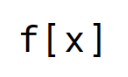

<p align="center">
  <a href="https://fluxions.ai"></a>
</p>

<h1 align="center">Vui — Streaming Conversational Voice Assistant</h1>

<p align="center"><em>Pronounced "vooey"</em> (rhymes with <em>Louie</em>) · by <a href="https://fluxions.ai">fluxions.ai</a></p>

<p align="center">
  <a href="https://huggingface.co/fluxions/vui"></a>
  <a href="https://discord.fluxions.ai"></a>
</p>

📖 **[Launch blog post](https://fluxions.ai/blog/vui-launch)** — design notes, demos, and what's next.

Vui is a real-time voice assistant: speak into your mic, the model transcribes, runs a local LLM, and streams a TTS reply back — all from a single Python server. Built around **Vui Nano**, a 300M speech transformer based on the Qwen3 TTS. Trained on conversational speech with breaths, laughter, hesitations, and multi-speaker dialogue.

## Features

- **Vui Nano (300M)** — Llama-style decoder + RQ-Transformer head over the Qwen3-TTS-12Hz codec
- **Real-time voice loop** — WebRTC + WebSocket pipeline (ASR → LLM → TTS) with a browser UI, VAD-driven turn taking, speculative LLM prefill while you're still speaking, sentence-level TTS chunking with backpressure
- **Barge-in** — start talking mid-reply, the model cancels and listens
- **Streaming TTS** — ~5× realtime on a 4090, bf16 inference, CUDA graphs
- **OpenAI Realtime API compatible** — drop-in `ws://…/v1/realtime` for clients written against OpenAI's spec ([`docs/realtime-api.md`](docs/realtime-api.md))
- **One-shot voice-note REST endpoint** — `POST /v1/voice-note` runs the whole ASR → LLM → TTS pipeline in a single HTTP call (audio in, JSON out)
- **Standalone TTS demo** — `demo.py` Gradio playground for the model on its own
- **Voice cloning** — upload an audio sample to clone any speaker; 4 fine-tuned presets shipped (`maeve`, `abraham`, `rhian`, `harry`)
- **SQ / WPS conditioning** — bias generation on six speech-quality channels and words-per-second
- **Hot-swap models** — pick Ollama LLM and ASR backend live from the UI
- **Pluggable ASR** — faster-whisper (GPU) or Moonshine (CPU streaming, ONNX)
- **Pluggable LLM backends** — Ollama, vLLM, any OpenAI-compatible endpoint
- **Memories** — assistant remembers facts about you across sessions (persisted to `~/.vui/memories.json`)
- **Thoughts stream** — parallel LLM routes voice intent to ~10 tools (memory ops, task control, delegation) without a wake-word grammar; pluggable for your own local tools
- **Optional Claude task server** — sidecar agent that handles slow/agentic work (Gmail, Calendar, Drive, Slack, web search) via your existing Claude Code MCPs; auto-discovered on boot
- **Non-Anthropic task backends** — point the task server at Ollama, z.ai, DeepSeek, vLLM, LM Studio, LiteLLM via the Anthropic-compatible `/v1/messages` envelope
- **Apple Silicon support** — MLX backend (WIP)
- **Mobile-ready** — documented cloudflared and Tailscale paths for phone access with mic over HTTPS
- **Docker compose** — one file brings up the full stack (streaming server + optional bundled Ollama + optional Claude task server)
- **OpenClaw integration** — point OpenClaw's `openai` realtime provider at Vui for a fully-local voice front-end

## Install (one-liner)

```sh
curl -fsSL https://install.fluxions.ai | bash
```

Clones into `~/vui`, auto-detects Docker vs. native, installs deps (uv, Ollama, ffmpeg, Claude Code CLI), pulls the model, and launches the stack on <http://localhost:8080>. Flags (`--docker`, `--native`, `--no-claude`, `--upgrade`, `--model <name>`, `--dry-run`) forward to `install.sh` — see `./install.sh --help` from the clone for the full list.

## Quick start (docker-compose, recommended)

The Vui streaming server runs from one compose file. The recommended setup is **Ollama on the host** (most users already have it) plus the Vui container — the container uses host networking and talks to your local Ollama at `localhost:11434`. Designed for **Linux + NVIDIA GPU**.

### Prerequisites

1. **Docker** with the Compose plugin (Docker Desktop 4.x or `docker-ce` ≥ 24).
2. **NVIDIA Container Toolkit** so the container can see the GPU:
   ```sh
   # Debian / Ubuntu — see https://docs.nvidia.com/datacenter/cloud-native/container-toolkit/
   sudo apt install -y nvidia-container-toolkit
   sudo nvidia-ctk runtime configure --runtime=docker
   sudo systemctl restart docker
   ```
   Verify: `docker run --rm --gpus all nvidia/cuda:13.0.0-base-ubuntu22.04 nvidia-smi`
3. **[Ollama](https://ollama.com) on the host** (or use the bundled containerised one — see below).

### Bring up the core stack
```sh
ollama pull qwen3.5:4b      # on the host
docker compose up -d
```
Open <http://localhost:8080>, allow mic access, start talking. The Vui checkpoint and Qwen codec download automatically from [Hugging Face](https://huggingface.co/fluxions/vui) on first run and persist in a named volume.

#### No host Ollama? Use the bundled one
If you'd rather have Ollama in a container too:
```sh
docker compose --profile ollama up -d
docker compose exec ollama ollama pull qwen3.5:4b
```
The bundled service is gated behind the `ollama` profile so it's off by default; the Vui container talks to whichever instance is running on `localhost:11434`.

### Optional: Claude task server

The compose file ships a `claude-task` profile — a sidecar Claude container on `:8642` for delegated agentic work (Gmail / Calendar reads, web research). See [Claude task server](#claude-task-server-optional) below for what it does, how to bring it up (compose or native), and how to back it with a non-Anthropic model.

### Common compose commands
```sh
docker compose ps                   # service status
docker compose logs -f vui-stream   # follow streaming server logs
docker compose restart vui-stream   # restart after a code change
docker compose down                 # stop everything
docker compose down -v              # ...and wipe HF cache + Ollama models
```

## Native install (alternative)

If you'd rather skip Docker. Both services run as plain Python processes; the task server is optional — without it `vui-stream` works fine and the "task server" pill in the UI just stays grey.

### Vui streaming server

**System dependency: ffmpeg.** `torchcodec` dynamically links against the ffmpeg shared libraries at runtime and will fail to import without them. Docker users get this for free; native installers need it on the host:

```sh
sudo apt install ffmpeg                     # Debian / Ubuntu
brew install ffmpeg                         # macOS
```

Then:

```sh
uv sync                  # base + flash-attn pre-built wheel on Linux
uv sync --extra mlx      # add for Apple Silicon
```

Install [Ollama](https://ollama.com), start it, pull a model, then run the streaming server (defaults to `:8080`):
```sh
ollama serve &                  # or your distro's systemd unit
ollama pull qwen3.5:4b
python -m vui.serving.stream    # http://localhost:8080
```

Point at a different LLM backend via env vars — both must be set in the shell that runs `python -m vui.serving.stream` (they hit separate code paths: chat/streaming vs. model-list/pull helpers):
```sh
export VUI_OLLAMA_URL="http://gpu-box.lan:11434"   # chat/streaming path
export OLLAMA_URL="http://gpu-box.lan:11434"       # model-list / pull / MLX detect
export VUI_OLLAMA_MODEL="qwen3:8b"                 # initial model (UI can switch live)
```
vLLM and other OpenAI-compatible backends are also supported (`VUI_LLM_BACKEND=vllm` + `VUI_VLLM_URL=…`); see [`docs/configuration.md`](docs/configuration.md#custom-model-server).

**Apple Silicon — MLX auto-setup (~1.9× faster decode, recommended):**
On first run the server auto-creates `qwen3.5-4b-mlx` via `ollama create --experimental --quantize int4` (~37 tok/s decode vs ~19 tok/s for GGUF Q4 on the same 4B model). Falls back to `qwen3.5:4b` GGUF if MLX setup fails. `--experimental` is required — without it Ollama converts to GGUF and you lose the speedup.

> **Help wanted — Apple Silicon.** Vui runs on Mac but the MLX path (TTS worker, MLX-Moonshine ASR, the `qwen3.5-4b-mlx` Ollama variant) hasn't had the same polish as the CUDA path. If you're a Mac user who'd like to help shake out rough edges — kernel perf, streaming stability on M-series, the docker-compose story for Apple Silicon — we'd love contributors. Open an issue or PR on the repo, or get in touch via [fluxions.ai](https://fluxions.ai).

### TTS demo on its own
```sh
python demo.py                                          # Gradio UI — upload your own voice prompt
python demo.py --render --prompt prompts/abraham.wav    # CLI render with a preset voice
```

Preset voices in `prompts/` (download from the [HF repo](https://huggingface.co/fluxions/vui)):

| Voice | Description |
|---|---|
| `maeve` | Recommended Default - Female Irish accent — beautiful but may be hard for non-UK listeners |
| `abraham` | British, well-spoken, exciting energy and personality — conscientious, good at emotionally difficult subjects |
| `rhian` | More traditional British accent, slightly hesitant speaking style |
| `harry` | British male accent, mumbly |

More personalities coming soon! Got a voice or character you'd like to hear? Open an issue or let us know on [Discord](https://discord.fluxions.ai).

#### Conditioning controls (SQ / WPS)

The demo's *Advanced* panel exposes two conditioning vectors that bias generation. Each is fed through a learned projection (`sq_proj` / `wps_proj` in `model.py`) and added to the text embeddings, so the model has been trained to associate the numbers with audible properties. Set any score to `0` to disable that channel — during training each was randomly masked, so partial conditioning is fine.

- **SQ — speech quality** (`0–5` each, six independent channels). Maps to the metrics the training data was scored with:
  - **DNS Signal** — DNSMOS signal clarity
  - **DNS Background** — DNSMOS background silence (5 = clean room)
  - **NISQA Noise** — perceptual noise level (5 = none)
  - **NISQA Disc.** — discontinuity / glitch artifacts (5 = smooth)
  - **NISQA Color.** — spectral colouration (5 = neutral timbre)
  - **NISQA Loudness** — volume level
- **WPS — words per second** (`0–6`, typical conversational range ~2–4). Speaking-rate target. Useful when a prompt is making the model rush or drag; leave at `0` to let it follow the prompt's natural pace (estimated from the prompt's word count and frame length, see `engine.py:749-754`).

Defaults `sq = (3.5, 4.0, 4.0, 4.0, 4.0, 0.0)` and `wps = 0` give neutral, clean output. Push SQ toward 5 across the board for cleaner-sounding audio (at the cost of some liveliness); drop them to mimic phone / lo-fi / noisy recordings.

## Claude task server (optional)

A sidecar process that handles delegated, agentic work — slow tool-using tasks (Gmail / Calendar / Drive / Slack reads, web research) the main voice loop shouldn't block on. It speaks Anthropic's `/v1/messages` and uses whatever MCPs you've hooked into Claude Code on the host, so adding a new integration is just `claude mcp add …`. While it grinds, a parallel "thoughts" LLM call keeps the conversation alive with filler ("yeah, let me check…") and the result gets POSTed back and spoken.

Bring up: `docker compose --profile claude up -d claude-task` (Docker) or `uv sync --extra claude && python -m vui.serving.claude_server` (native). Auth: a Claude Code subscription (preferred — uses `~/.claude/.credentials.json`) or `ANTHROPIC_API_KEY`. Backs onto Ollama, z.ai, DeepSeek, vLLM, LM Studio, LiteLLM via `ANTHROPIC_BASE_URL`.

Full setup, auth options, MCP examples, model picks, non-Anthropic backends, and a fully-local Ollama-backed worked example: [`docs/claude-task-server.md`](docs/claude-task-server.md).

## Talk from your phone

Mobile browsers need HTTPS for mic access, and Vui's WebRTC media goes peer-to-peer to the server's LAN IP — so the right path depends on where your phone is:

| Where's the phone? | Easiest path |
|---|---|
| **Same Wi-Fi as the server** | `cloudflared tunnel --url http://localhost:8080` — one command, HTTPS, no account |
| **Cellular / away from home** | [Tailscale](https://tailscale.com) — host-candidate WebRTC just works on the tailnet |
| **Custom client, anywhere** | Build against `/v1/realtime` — all-WebSocket, traverses any HTTPS proxy |

Full setup, named-tunnel options, and gotchas: [`docs/mobile.md`](docs/mobile.md).

## Architecture

```
mic ──► WebRTC ─► VAD ─► faster-whisper ─► Ollama LLM ─► Vui TTS ─► WebRTC ─► speaker
                                              │
                                              └─► thoughts stream (parallel tool router)
                                                  ├─ memories
                                                  └─ delegated tasks (optional)
```

Three OS processes connected by `torch.multiprocessing.Queue`:

| Process | GPU | Role |
|---|---|---|
| Main (`server.py`) | No | aiohttp, WebRTC/WS, Ollama LLM streaming, conversation state |
| TTS worker | Yes | Vui + RQ-Transformer + Qwen codec, CUDA graphs, streaming |
| ASR worker | Yes/CPU | faster-whisper or Moonshine + Silero VAD |

## Configuration

UI controls, supported LLM/ASR models, and how to point at a custom (remote vLLM / Ollama / OpenAI-compatible) server are documented in [`docs/configuration.md`](docs/configuration.md).

### ASR: Whisper or Moonshine

Two ASR families ship in the box, switchable live from the UI dropdown. The default is **`fwhisper.distil-small.en`** (faster-whisper, GPU) for English; switch to **[Moonshine](https://github.com/usefulsensors/moonshine)** (ONNX, CPU) to keep ASR off the GPU. Full backend matrix and tuning levers: [`docs/configuration.md`](docs/configuration.md#asr-models).

## Realtime API + voice-note endpoint

Vui exposes an **OpenAI Realtime-compatible WebSocket** at `ws://localhost:8080/v1/realtime` — same event names (`session.update`, `input_audio_buffer.append`, `response.create`, `response.audio.delta`, …), same PCM16 @ 24 kHz audio. Clients written against OpenAI's spec mostly just work.

There's also a synchronous **`POST /v1/voice-note`** that runs the whole ASR → LLM → TTS pipeline in a single HTTP call (audio in, JSON-with-base64-WAV out) — useful for push-to-talk bots, iOS Shortcuts, or Home Assistant automations.

Event surface, supported/unsupported events, a minimal Python client, the OpenClaw integration recipe, and full voice-note request/response shapes are in [`docs/realtime-api.md`](docs/realtime-api.md).

## The soul

What other projects call a "system prompt", Vui calls the **soul** — the persona prompt that defines speech style (short sentences, fillers, no markdown, phonetic numbers), conversational rules (confirm scope, chunk lists in threes, no fabrication), and tool-aware filler behaviour. It lives in `src/vui/serving/stream/prompts.py` (`SOUL`) and is edited live from the **Soul** textarea in the UI — saves to `prompts/.soul` and re-prefills the LLM. Realtime API clients can also set it via the standard `instructions` field.

Why a different name? Because "system prompt" is correct but joyless. The soul is the single biggest lever you have over how the assistant behaves — swap it and you swap the personality, no fine-tuning required. Name borrowed from [OpenClaw](https://github.com/openclaw/openclaw), where the same idea is also called the *soul*. Full breakdown of what it bakes in and how to edit it: [`docs/soul.md`](docs/soul.md).

## Voice controls

You don't need a wake-word grammar — the **thoughts stream** (`src/vui/serving/stream/thoughts.py`) is a parallel LLM that watches every turn and picks one of ~10 tools by intent. The conversation reply happens in parallel, so memory ops and task control feel near-instant; delegation cancels the in-flight reply and hands off to `claude-task`. Want to add your own local tool (e.g. timers, smart-home toggles) instead of routing it through `claude-task`? See [`docs/thoughts-tools.md`](docs/thoughts-tools.md).

| Intent | Say something like… | What happens |
|---|---|---|
| **Save a memory** | "remember I'm allergic to nuts", "my daughter's name is Lily" | `add_memory` — durable facts only (name, job, family, prefs); transient stuff like "I'm tired today" is ignored. Updates an existing memory if it covers the same topic. |
| **Forget a memory** | "forget I have a dog", "you can drop the bit about my old job" | `remove_memory` — fuzzy-matched on content. |
| **Wipe all memories** | "clear all memories", "wipe everything you know about me" | `clear_memories`. |
| **Delegate a task** | "check my unread emails", "what's on my calendar tomorrow?", "search the web for X" | `delegate` — fires off to `claude-task`, plays filler ("yeah, let me check…"), speaks the result when done. |
| **List tasks** | "what tasks are running?", "show my tasks" | `list_tasks` — reads them out. |
| **Check one task** | "is that done yet?", "tell me what you found again" | `check_task` — re-speaks the cached result, no re-run. |
| **Cancel a task** | "cancel that", "stop the email search", "never mind it" | `cancel_task` — leaves the entry visible as `cancelled`. |
| **Delete a task** | "delete that one", "get rid of the search task" | `delete_task` — cancels if running, then removes from the list. |
| **Clear all tasks** | "clear all tasks", "wipe my tasks" | `clear_tasks`. |
| **Reset conversation** | "let's start over", "clear the conversation" | `clear_context` — drops history, keeps memories. |

Memories are loaded from `~/.vui/memories.json` on startup and rewritten on every add/remove, so they survive restarts. Tasks live in-memory on the streaming server only — they're not persisted, so a `vui-stream` restart starts you with an empty task list. Trigger phrases are intent-based, not literal — "make a note that…" works as well as "remember…", and ASR errors are tolerated ("male" → "email").

### How it picks a tool

The thoughts stream is a second parallel LLM call on every turn — same Ollama model, different prompt, never speaks, forced to emit exactly one tool call at `temperature=0.0`. Its system prompt is built dynamically from a preamble + the live AVAILABLE TOOLS list + CURRENT MEMORIES + per-tool `RULE` blocks; a second system message lists CURRENT TASKS with result excerpts so follow-up questions ("what was the second one?") map to `no_action` instead of re-delegating.

Adding your own tool is one file in `src/vui/serving/stream/tools/` then `POST /tools/reload`. Full prompt anatomy, KV-warming details, and the tool-authoring contract: [`docs/thoughts-tools.md`](docs/thoughts-tools.md).

## Vui Nano

A 300M autoregressive LM over the Qwen3-TTS speech codec — the first in the Vui model family. The codec and speaker encoder are reused from Alibaba's [`Qwen3-TTS-12Hz-0.6B-Base`](https://huggingface.co/Qwen/Qwen3-TTS-12Hz-0.6B-Base);

- **300M parameters**, Llama-style decoder + RQ-Transformer head — 768 dim, 22 layers, 8 heads
- **Codec**: [Qwen3-TTS-Tokenizer-12Hz](https://huggingface.co/Qwen/Qwen3-TTS-Tokenizer-12Hz) — 16 codebooks of 2048 entries at 12.5 Hz, 24 kHz audio (decoded), pure-PyTorch reimplementation in `src/vui/qwen_codec.py`
- **Speaker encoder**: ECAPA-TDNN from `Qwen3-TTS-12Hz-0.6B-Base` (8.9M params, 1024-dim) — used at training time to embed reference speakers
- **Output**: 16 kHz audio, bf16 inference, ~5× realtime streaming on a 4090

### Voices & voice cloning

**The model can clone arbitrary voices** — upload a sample in the demo UI (or drop a `.wav` into `prompts/`) and it will follow that speaker. **Cloned voices won't sound as good as the four fine-tuned voices** (`maeve`, `abraham`, `rhian`, `harry`) shipped in `prompts/` — the released checkpoint has been fine-tuned on those four, so they're the highest-quality output the model can produce. Arbitrary clones work but expect lower naturalness, more drift, and some bias toward the fine-tuned speakers' prosody.

For best results: voice-prompt transcript must match the audio word-for-word, aim for **30 seconds or more** of clean source audio (6-minute context window), and remember garbage in = garbage out. Full guide on voice prompts, supported tags ([breath], [laugh], [sigh] …), punctuation rules, and phonetic spelling for numbers/dates/units: [`docs/prompting.md`](docs/prompting.md).

If you need a checkpoint tuned to a specific voice for a legitimate use case (audiobooks, accessibility, game characters, dubbing of consenting performers, internal tooling), **get in touch** via [fluxions.ai](https://fluxions.ai) — we can train, license, or host one for you.

```python
from vui.engine import Engine, GenConfig

engine = Engine.from_checkpoint("vui.pt")
with engine.new_row() as row:
    audio = row.render(
        "So [breath] the thing about this is, it's not what you'd expect, right?",
        GenConfig(temperature=0.7),
    )
```

For long voice prompts (>15s) you need proper multi-segment chunking — `vui.prompt_utils.build_prompt_segments` does ASR + forced alignment + sentence-boundary splits at ~10s targets so the model keeps its speaker conditioning across the full reference. Full Python guide covering chunked prompts, streaming, continuous batching, codes-only decode, and the MLX path: [`docs/python-api.md`](docs/python-api.md).

## Hardware

Streaming server and `demo.py` both run on either:
- **NVIDIA GPU + Linux** — ~**12 GB VRAM** for the full stack (TTS + ASR + Ollama LLM, 4090 / H100 tested), drops to **~8 GB** if you switch to a `moonshine.*` (CPU) ASR backend. CUDA 12.x, flash-attn installed.
- **Apple Silicon Mac** — M1/M2/M3/M4, MLX backend (auto-detected, no flash-attn required).

Full breakdown — measured per-component VRAM, ASR latency/VRAM per backend, KV-cache math, and tuning levers — is in [`docs/memory-budget.md`](docs/memory-budget.md).

**Tip: drop `n_codebooks` for faster TTS on smaller GPUs.** The RQ-Transformer head decodes 16 RVQ codebook levels per audio frame by default. Dropping the **Codebooks** slider in the UI (or `n_codebooks` in `DEFAULT_SETTINGS`, server.py:228) to **~10** gives noticeably faster decode and lower VRAM at the cost of some stability — occasional artefacts, more sensitivity to hard prompts. Below 8 quality drops sharply. `0` means "use all 16".


## Responsible use

Vui generates speech that can sound convincingly human. By using this model — directly, through the streaming server, or through the realtime API — you agree to the following:

We **explicitly prohibit**:

- **Fraud** — generating speech to deceive others for financial gain or to obtain something you would not otherwise be entitled to (scam calls, voice-auth bypass, etc.).
- **Misinformation or deception** — fake news, fraudulent calls, deepfakes intended to mislead, synthetic media presented as authentic recordings of real people.
- **Harassment, defamation, or abuse** — generating speech that targets, threatens, or harms others, including non-consensual sexual content.
- **Illegal activity** — anything unlawful in the jurisdiction where the model is run or its output is distributed.

You are responsible for what you generate. The released checkpoint is fine-tuned to a curated voice set in part to make these misuses harder, but it is not a substitute for your own judgment. If you build a product on top of Vui, build in consent flows, content provenance (e.g. [C2PA](https://c2pa.org/)), and abuse reporting.

We are **not responsible** for misuse, and we strongly condemn unethical applications of this technology.


## Telemetry

Vui sends an anonymous event each time it renders audio so we can see which preset voices people use and roughly how much speech the model produces in the wild. **What's sent**: `{voice, seconds}` plus `app: "vui"`. **Not sent**: transcripts, audio, prompt text, user identifiers, install ID, IP. Fire-and-forget — failures or unreachable endpoints cannot slow the voice loop (see `src/vui/telemetry.py`).

Disable with an env var:

```sh
export VUI_TELEMETRY=0
python -m vui.serving.stream
```

For Docker, add `VUI_TELEMETRY=0` to the `vui-stream` service environment in `docker-compose.yml`.

## Attributions

- [Qwen3-TTS-Tokenizer](https://huggingface.co/Qwen/Qwen3-TTS-Tokenizer-12Hz) — Alibaba
- [Whisper](https://github.com/openai/whisper) — OpenAI
- [faster-whisper](https://github.com/SYSTRAN/faster-whisper)
- [Moonshine](https://github.com/usefulsensors/moonshine) — Useful Sensors (CPU-streaming ASR option)
- [Silero VAD](https://github.com/snakers4/silero-vad)
- [aiortc](https://github.com/aiortc/aiortc)
- [Ollama](https://ollama.com) — local LLM runtime (default backend for the assistant + optional Anthropic-compatible endpoint for the task server)


## License

Apache 2.0 — applies to the code in this repository. The released model weights are governed by their own terms (see the model card on Hugging Face). The Qwen3-TTS-Tokenizer-12Hz codec and `Qwen3-TTS-12Hz-0.6B-Base` speaker encoder are © Alibaba and licensed under the terms in their respective Hugging Face repos.


## Citation

```bibtex
@software{vui_2026,
  author  = {Coultas Blum, Harry},
  title   = {Vui: Streaming Conversational Text-to-Speech},
  url     = {https://github.com/fluxions-ai/vui},
  version = {1.0.0},
  year    = {2026}
}
```
