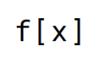

<p align="center">
  <a href="https://fluxions.ai"></a>
</p>

<h1 align="center">Vui — Streaming Conversational Voice Assistant</h1>

<p align="center"><strong>Powered by Vui Nano — a small, context-aware text-to-speech model trained on real conversations: 219M active parameters (305M total), Apache 2.0, voice cloning, real-time streaming, runs on CPU</strong></p>

<p align="center"><em>Pronounced "vooey"</em> (rhymes with <em>Louie</em>) · by <a href="https://fluxions.ai">fluxions.ai</a></p>

<p align="center">
  <a href="https://fluxions.ai/talk"></a>
  <a href="https://huggingface.co/fluxions/vui"></a>
  <a href="https://discord.fluxions.ai"></a>
</p>

<p align="center"><strong>🎙️ Try it live at <a href="https://fluxions.ai/talk">fluxions.ai/talk</a></strong></p>

<table align="center"><tr><td>
  <video src="https://github.com/user-attachments/assets/d04de946-3b39-4fc1-bbba-5b1c5ba373ee" controls width="564"></video>
</td></tr></table>

📖 **[Launch blog post](https://fluxions.ai/blog/vui-launch)** — design notes, demos, and what's next.

**Vui** is short for **V**oice **U**ser **I**nterface — the layer that lets you talk to a computer and have it talk back.

Vui is a real-time voice assistant: speak into your mic, the model transcribes, runs a local LLM, and streams a TTS reply back — all from a single Python server.

It is built around **Vui Nano — a small, context-aware text-to-speech model trained on real conversations: 219M active parameters (305M total), Apache 2.0, with voice cloning, real-time streaming, and a dependency-free C build that runs on CPU.**

Most TTS models synthesise one utterance in isolation. Vui Nano generates each reply *inside the conversation*: the whole dialogue so far — your text **and the actual audio of your turn** — lives in the KV cache it decodes from, across a ~6-minute context. It was trained on two-speaker dialogue with an explicit speaker-change token, so it carries prosody across turns and produces the things real speech has and read-aloud corpora don't: breaths, laughter, hesitations, and overlap.

The handful of other open models that condition on dialogue acoustics this way are an order of magnitude larger and GPU-only. Vui Nano does it at 219M active parameters, and the C build in [`cpu/`](cpu/README.md) does it on a CPU with no Python, PyTorch, or ONNX at runtime.

Want the TTS model on its own, without the assistant? See [Vui Nano](#vui-nano) for the model card, `demo.py` for a standalone Gradio playground, and [`cpu/`](cpu/README.md) for the single-binary CPU build.

> **Want the latest models and production-grade turn-taking?** This repo is the open core. Our [production API](https://fluxions.ai) ships ongoing model updates and a more advanced turn-taking system, on hardened, low-latency infrastructure built for scale. Get in touch at [fluxions.ai](https://fluxions.ai).

## Features

- **Vui Nano (219M active, 305M total)** — a small, context-aware TTS model trained on real conversations: Llama-style decoder + RQ-Transformer head over the Qwen3-TTS-12Hz codec, Apache 2.0
- **Conversation-conditioned generation** — replies are decoded from a KV cache holding the whole dialogue, including the audio of your turn, so prosody carries across turns (~6-minute context)
- **Real-time voice loop** — WebRTC + WebSocket pipeline (ASR → LLM → TTS) with a browser UI, VAD-driven turn taking, speculative LLM prefill while you're still speaking, sentence-level TTS chunking with backpressure
- **Barge-in** — start talking mid-reply, the model cancels and listens
- **Streaming TTS** — ~9× realtime on a 4090, bf16 inference, CUDA graphs
- **OpenAI Realtime API compatible** — drop-in `ws://…/v1/realtime` for clients written against OpenAI's spec ([`docs/realtime-api.md`](docs/realtime-api.md))
- **One-shot voice-note REST endpoint** — `POST /v1/voice-note` runs the whole ASR → LLM → TTS pipeline in a single HTTP call (audio in, JSON out)
- **Standalone TTS demo** — `demo.py` Gradio playground for the model on its own
- **CPU inference, zero dependencies** — a pure-C engine ([`cpu/`](cpu/README.md)): one binary plus one weight file, no Python, PyTorch, or ONNX at runtime; supports voice cloning and streaming playback
- **Voice cloning** — upload an audio sample to clone any speaker; 4 fine-tuned presets shipped (`maeve`, `abraham`, `rhian`, `harry`)
- **SQ / WPS conditioning** — bias generation on six speech-quality channels and words-per-second
- **Hot-swap models** — pick Ollama LLM and ASR backend live from the UI
- **Pluggable ASR** — faster-whisper (GPU) or Moonshine (CPU streaming, ONNX)
- **Pluggable LLM backends** — Ollama, vLLM, any OpenAI-compatible endpoint
- **Memories** — assistant remembers facts about you across sessions (persisted to `~/.vui/memories.json`)
- **Thoughts stream** — parallel LLM routes voice intent to ~15 tools (memory ops, task control, timers, web search, delegation) without a wake-word grammar; pluggable for your own local tools
- **Built-in web search** — single-query factual lookups ("weather in London", "price of X", "who won the match") via Serper, Brave, or Tavily — one API round-trip, no agent loop; falls through to `delegate` for multi-step research
- **Optional Claude task server** — sidecar agent that handles slow/agentic work (Gmail, Calendar, Drive, Slack, multi-step web research) via your existing Claude Code MCPs; auto-discovered on boot
- **Non-Anthropic task backends** — point the task server at Ollama, z.ai, DeepSeek, vLLM, LM Studio, LiteLLM via the Anthropic-compatible `/v1/messages` envelope
- **Apple Silicon support** — the `Engine` Python API auto-dispatches to an MLX backend (quantized vui-nano-1.1, ~1.5–2.7× real-time on M4; pre-baked weights auto-download when published, otherwise converted once locally), `demo.py` and `demo.py --render` work end-to-end; the streaming-server MLX glue is WIP
- **Mobile-ready** — documented cloudflared and Tailscale paths for phone access with mic over HTTPS
- **Docker compose** — one file brings up the full stack (streaming server + optional bundled Ollama + optional Claude task server)
- **OpenClaw integration** — point OpenClaw's `openai` realtime provider at Vui for a fully-local voice front-end

## Install (one-liner)

```sh
curl -fsSL https://install.fluxions.ai | bash
```

Clones into `~/vui`, auto-detects Docker vs. native, installs deps (uv, ffmpeg libs, Claude Code CLI), and launches the stack on <http://localhost:8080>. The native path needs no sudo. The TTS weights are not pulled here — they download from Hugging Face on first render.

Flags (`--docker`, `--native`, `--llm <backend>`, `--no-claude`, `--no-launch`, `--upgrade`, `--model <name>`, `--dry-run`) forward to `install.sh` — see `./install.sh --help` from the clone for the full list. Note `--model` selects the **Ollama LLM** (default `qwen3.5:4b`), not the TTS checkpoint; to change that, pass a name or path to `Engine()`.

## Quick start (docker-compose, recommended)

The Vui streaming server runs from one compose file. The recommended setup is **Ollama on the host** (most users already have it) plus the Vui container — the container uses host networking and talks to your local Ollama at `localhost:11434`. Designed for **Linux + NVIDIA GPU**.

### Prerequisites

1. **Docker** with the Compose plugin (Docker Desktop 4.x or `docker-ce` ≥ 24).
2. **NVIDIA Container Toolkit** so the container can see the GPU:
   ```sh
   # Debian / Ubuntu — see https://docs.nvidia.com/datacenter/cloud-native/container-toolkit/
   sudo apt install -y nvidia-container-toolkit
   sudo nvidia-ctk runtime configure --runtime=docker
   sudo systemctl restart docker
   ```
   Verify: `docker run --rm --gpus all nvidia/cuda:13.0.0-base-ubuntu22.04 nvidia-smi`
3. **[Ollama](https://ollama.com) on the host** (or use the bundled containerised one — see below).

### Bring up the core stack
```sh
ollama pull qwen3.5:4b      # on the host
docker compose up -d
```
Open <http://localhost:8080>, allow mic access, start talking. The Vui checkpoint and Qwen codec download automatically from [Hugging Face](https://huggingface.co/fluxions/vui) on first run and persist in a named volume.

#### No host Ollama? Use the bundled one
If you'd rather have Ollama in a container too:
```sh
docker compose --profile ollama up -d
docker compose exec ollama ollama pull qwen3.5:4b
```
The bundled service is gated behind the `ollama` profile so it's off by default; the Vui container talks to whichever instance is running on `localhost:11434`.

### Optional: Claude task server

The compose file ships a `claude-task` profile — a sidecar Claude container on `:8642` for delegated agentic work (Gmail / Calendar reads, web research). See [Claude task server](#claude-task-server-optional) below for what it does, how to bring it up (compose or native), and how to back it with a non-Anthropic model.

### Common compose commands
```sh
docker compose ps                   # service status
docker compose logs -f vui-stream   # follow streaming server logs
docker compose restart vui-stream   # restart after a code change
docker compose down                 # stop everything
docker compose down -v              # ...and wipe HF cache + Ollama models
```

## Native install (alternative)

If you'd rather skip Docker. Both services run as plain Python processes; the task server is optional — without it `vui-stream` works fine and the "task server" pill in the UI just stays grey.

### Vui streaming server

**System dependency: the ffmpeg shared libraries.** `torchcodec` links against `libavcodec`/`libavformat`/`libavutil` at runtime and won't import without them. Note it's the *libraries* — Vui never runs the `ffmpeg` binary, so the static-binary PyPI packages (`static-ffmpeg`, `imageio-ffmpeg`, `ffmpeg-binaries`) do **not** satisfy it. Docker users get this for free. Otherwise:

```sh
sudo apt install ffmpeg                     # Debian / Ubuntu
brew install ffmpeg                         # macOS
```

No root? `./install.sh --native` fetches an LGPL shared build into `~/.cache/vui/ffmpeg` and preloads it — nothing goes on `LD_LIBRARY_PATH`. See [`docs/rootless-install.md`](docs/rootless-install.md), which also covers building ffmpeg from source.

Then:

```sh
uv sync                  # base + flash-attn pre-built wheel on Linux (x86_64 + aarch64)
# Apple Silicon: MLX installs automatically (platform markers) — plain `uv sync` is enough
```

Pre-built flash-attn wheels are pinned for Linux x86_64 and aarch64, so ARM
servers (Grace-Hopper, Grace-Blackwell) get the real kernel. Where it can't run
— Jetson parts, whose compute capability isn't in the wheel, plus CPU/macOS —
`vui.flash_compat` transparently switches to a pure-PyTorch SDPA kernel: same
outputs, slower decode. `VUI_ATTN=torch` forces that path anywhere.

Install [Ollama](https://ollama.com), start it, pull a model, then run the streaming server (defaults to `:8080`):
```sh
ollama serve &                  # or your distro's systemd unit
ollama pull qwen3.5:4b
python -m vui.serving.stream    # http://localhost:8080
```

Point at a different LLM backend via env vars in the shell that runs `python -m vui.serving.stream`:
```sh
export VUI_OLLAMA_URL="http://gpu-box.lan:11434"   # bare OLLAMA_URL also works
export VUI_OLLAMA_MODEL="qwen3:8b"                 # initial model (UI can switch live)
```
vLLM and other OpenAI-compatible backends are also supported (`VUI_LLM_BACKEND=vllm` + `VUI_VLLM_URL=…`); see [`docs/configuration.md`](docs/configuration.md#custom-model-server).

**Apple Silicon — MLX auto-setup (~1.9× faster decode, recommended):**
On first run the server auto-creates `qwen3.5-4b-mlx` via `ollama create --experimental --quantize int4` (~37 tok/s decode vs ~19 tok/s for GGUF Q4 on the same 4B model). Falls back to `qwen3.5:4b` GGUF if MLX setup fails. `--experimental` is required — without it Ollama converts to GGUF and you lose the speedup.

> **Apple Silicon status.** TTS on MLX **works**: `Engine()` auto-dispatches to a single-row MLX backend with the same Row API (prefill / render / stream / rewind), `python demo.py` and `demo.py --render` run end-to-end (int8 vui-nano-1.1, ~1.5–2.7× real-time on M4), and the pre-baked quantized weights auto-download on first run — no torch conversion step. Even the [pre-1.0 legacy checkpoints](docs/legacy.md) run with an MLX decoder. The **rest of the MLX stack is WIP**: MLX-Moonshine ASR, streaming-server glue, the `qwen3.5-4b-mlx` Ollama variant, and the docker-compose story haven't had the same polish as the CUDA path. If you're a Mac user who'd like to help shake out rough edges — kernel perf, streaming stability on M-series — we'd love contributors. Open an issue or PR on the repo, or get in touch via [fluxions.ai](https://fluxions.ai).

### Hardware support

The model picks its dtype and attention kernel from the GPU at runtime, and `install.sh` picks the CUDA build of torch to match. In most cases there is nothing to configure.

| Compute capability | Examples | dtype | Attention | Notes |
|---|---|---|---|---|
| 9.0 / 10.0 / 12.0 | H100, GH200, B200 | bf16 | FlashAttention-2 | |
| 8.0–8.9 | A100, A6000, RTX 30xx/40xx, L4 | bf16 | FlashAttention-2 | |
| 7.5 | T4, RTX 20xx, Quadro RTX | bf16 (emulated) | PyTorch SDPA | No hardware bf16 and no FA2 kernels; both handled automatically. Verified on a real T4. |
| 7.0 | V100, Titan V | bf16 (emulated) | PyTorch SDPA | Also needs a CUDA 12 torch — recent wheels carry no `sm_70` kernels. `install.sh` pins `UV_TORCH_BACKEND=cu126`. **Untested.** |
| none | CPU / macOS | fp32 | PyTorch SDPA | The streaming server wants a GPU; standalone CPU inference lives in [`cpu/`](cpu/README.md). |

**Never fp16.** It looks like the obvious pre-Ampere choice — bf16's precision, half fp32's memory — but it loses most of bf16's exponent range, and this model's activations overflow it: the decode samples an out-of-range token and dies in `scatter_add_` with a device-side assert. Below Ampere bf16 is used instead, emulated rather than accelerated; on a T4 that measured ~20% faster than fp32 at no cost in accuracy. `VUI_DTYPE=fp16` is still accepted if you want to try fixing it.

Measured on one RTX 4090, rendering the same line (WER via Moonshine against the input text):

| Config | RTX 4090 (8.9) | Tesla T4 (7.5) |
|---|---|---|
| bf16 + FlashAttention-2 | WER 0.000 · RTF 8.6× | n/a (no FA2 kernels) |
| bf16 + SDPA | WER 0.042 · RTF 3.2× | WER 0.000 · RTF 1.25× |
| fp32 + SDPA | WER 0.000 · RTF 1.3× | WER 0.125 · RTF 1.02× |
| fp16 | crashes | crashes |

So the SDPA fallback is sound, and a T4 runs just above realtime. Figures are one fixed-seed render per configuration — reproducible, but the RTF numbers carry more weight than the WER ones.

(The script also reports waveform correlation against the baseline. Expect it to be low: sampling is stochastic and any numerical difference changes which token is drawn, after which the waveforms diverge entirely. WER is the metric that means something here.)

FlashAttention-2 is an **optional extra**, not a requirement — its wheels are `sm_80+` with no PTX, so below Ampere it can't run at all and `vui.flash_compat` uses a pure-PyTorch SDPA path with the same semantics (correct, slower). `install.sh` adds `--extra flash` only where it will work; by hand it's `uv sync --extra flash`.

**When something looks wrong, start here:**

```sh
python -m vui.doctor
```

It reports the GPU and its compute capability, whether the installed torch actually has kernels for it, the resolved dtype, which attention path is active, whether torchcodec can load ffmpeg, and whether the LLM backend is reachable — each with a remedy. Exit code is non-zero only for genuinely blocking problems. `install.sh` runs it for you before starting the server.

Overrides, if the automatic choice is wrong: `VUI_DTYPE=bf16|fp16|fp32` and `VUI_ATTN=torch`.

### Running without root

`./install.sh --native` needs no sudo and no Docker. Everything lands in `$HOME`: `~/.local/bin` (uv, Claude CLI), `~/.cache/vui/ffmpeg` (ffmpeg shared libs), `~/.cache/huggingface` (weights), `~/.vui` (TLS cert, memories, tasks). Every port is unprivileged (8080/8443/8642), GPU access needs no group membership — the CUDA userspace comes from pip wheels — and audio is WebRTC in the browser, so there's no `/dev/snd` to get access to.

The one thing the installer will not do is install Ollama: its installer requires root, writes to `/usr/local`, and adds a systemd unit. So on the native path it either uses an Ollama you already run, or defaults to **vLLM**, which is pip-installable:

```sh
uv run --with 'vllm==0.26.0' python -m vllm.entrypoints.openai.api_server \
    --model google/gemma-4-E4B-it --max-model-len 8192 \
    --max-num-seqs 1 --enforce-eager --gpu-memory-utilization 0.6 \
    --enable-auto-tool-choice --tool-call-parser gemma4 --port 8000
```

Those flags are sized for a single user sharing one GPU with the TTS and ASR workers, and none of them are optional:

| Flag | Why |
|---|---|
| `--max-num-seqs 1` | One request's worth of KV cache. vLLM otherwise reserves slots for many concurrent sequences you'll never use. |
| `--enforce-eager` | Skips CUDA graph capture — saves both VRAM and a chunk of startup time. |
| `--gpu-memory-utilization 0.6` | vLLM defaults to **0.9 and pre-allocates**, which starves the TTS worker and OOMs it at startup. Size this to weights + one request's KV; 0.6 suits a ~9 GiB model on a 24 GiB card. |
| `--enable-auto-tool-choice --tool-call-parser gemma4` | Both are required together, or vLLM returns **400 to every request carrying tools** — not just ones the model would answer with a call. The parser is model-specific: `gemma4` for gemma-4, `hermes` for Qwen3. |

No LLM at all is fine: the server still binds, TTS and ASR work, and the `llm` pill turns green by itself once a backend appears. Details and the from-source ffmpeg build in [`docs/rootless-install.md`](docs/rootless-install.md).

### TTS demo on its own
```sh
python demo.py                                          # Gradio UI — upload your own voice prompt
python demo.py --render --prompt prompts/abraham.wav    # CLI render with a preset voice
```

Preset voices in `prompts/` (download from the [HF repo](https://huggingface.co/fluxions/vui)):

| Voice | Description |
|---|---|
| `maeve` | Recommended Default - Female Irish accent — beautiful but may be hard for non-UK listeners |
| `abraham` | British, well-spoken, exciting energy and personality — conscientious, good at emotionally difficult subjects |
| `rhian` | More traditional British accent, slightly hesitant speaking style |
| `harry` | British male accent, mumbly |

More personalities coming soon! Got a voice or character you'd like to hear? Open an issue or let us know on [Discord](https://discord.fluxions.ai).

#### Conditioning controls (SQ / WPS)

The demo's *Advanced* panel exposes two conditioning vectors that bias generation. Each is fed through a learned projection (`sq_proj` / `wps_proj` in `model.py`) and added to the text embeddings, so the model has been trained to associate the numbers with audible properties. Set any score to `0` to disable that channel — during training each was randomly masked, so partial conditioning is fine.

- **SQ — speech quality** (`0–5` each, six independent channels). Maps to the metrics the training data was scored with:
  - **DNS Signal** — DNSMOS signal clarity
  - **DNS Background** — DNSMOS background silence (5 = clean room)
  - **NISQA Noise** — perceptual noise level (5 = none)
  - **NISQA Disc.** — discontinuity / glitch artifacts (5 = smooth)
  - **NISQA Color.** — spectral colouration (5 = neutral timbre)
  - **NISQA Loudness** — volume level
- **WPS — words per second** (`0–6`, typical conversational range ~2–4). Speaking-rate target. Useful when a prompt is making the model rush or drag; leave at `0` to let it follow the prompt's natural pace (estimated from the prompt's word count and frame length, see `engine.py:771-773`).

Defaults `sq = (0, 0, 0, 0, 0, 5)` and `wps = 0` — only **loudness** is conditioned (pinned to 5), the other five channels are disabled. This gives the most consistent output in practice. To bias toward cleaner audio (at the cost of some liveliness), push the first five channels up toward 5; to mimic phone / lo-fi / noisy recordings, set them to **low non-zero values (~1–2)** — setting them to `0` doesn't make output lo-fi, it just turns the channel off (the `sq_proj` is a bias-free linear layer, so 0 → no contribution).

## Claude task server (optional)

A sidecar process that handles delegated, agentic work — slow tool-using tasks (Gmail / Calendar / Drive / Slack reads, web research) the main voice loop shouldn't block on. It speaks Anthropic's `/v1/messages` and uses whatever MCPs you've hooked into Claude Code on the host, so adding a new integration is just `claude mcp add …`. While it grinds, a parallel "thoughts" LLM call keeps the conversation alive with filler ("yeah, let me check…") and the result gets POSTed back and spoken.

Bring up: `docker compose --profile claude up -d claude-task` (Docker) or `uv sync --extra claude && python -m vui.serving.claude_server` (native). Auth: a Claude Code subscription (preferred — uses `~/.claude/.credentials.json`) or `ANTHROPIC_API_KEY`. Backs onto Ollama, z.ai, DeepSeek, vLLM, LM Studio, LiteLLM via `ANTHROPIC_BASE_URL`.

Full setup, auth options, MCP examples, model picks, non-Anthropic backends, and a fully-local Ollama-backed worked example: [`docs/claude-task-server.md`](docs/claude-task-server.md).

## Talk from your phone

Mobile browsers need HTTPS for mic access, and Vui's WebRTC media goes peer-to-peer to the server's LAN IP — so the right path depends on where your phone is:

| Where's the phone? | Easiest path |
|---|---|
| **Same Wi-Fi as the server** | `cloudflared tunnel --url http://localhost:8080` — one command, HTTPS, no account |
| **Cellular / away from home** | [Tailscale](https://tailscale.com) — host-candidate WebRTC just works on the tailnet |
| **Custom client, anywhere** | Build against `/v1/realtime` — all-WebSocket, traverses any HTTPS proxy |

Full setup, named-tunnel options, and gotchas: [`docs/mobile.md`](docs/mobile.md).

## Architecture

```
mic ──► WebRTC ─► VAD ─► faster-whisper ─► Ollama LLM ─► Vui TTS ─► WebRTC ─► speaker
                                              │
                                              └─► thoughts stream (parallel tool router)
                                                  ├─ memories
                                                  └─ delegated tasks (optional)
```

Three OS processes connected by `torch.multiprocessing.Queue`:

| Process | GPU | Role |
|---|---|---|
| Main (`server.py`) | No | aiohttp, WebRTC/WS, Ollama LLM streaming, conversation state |
| TTS worker | Yes | Vui + RQ-Transformer + Qwen codec, CUDA graphs, streaming |
| ASR worker | Yes/CPU | faster-whisper or Moonshine + Silero VAD |

## Configuration

UI controls, supported LLM/ASR models, and how to point at a custom (remote vLLM / Ollama / OpenAI-compatible) server are documented in [`docs/configuration.md`](docs/configuration.md).

### ASR: Whisper or Moonshine

Two ASR families ship in the box, switchable live from the UI dropdown. The default is **`fwhisper.distil-small.en`** (faster-whisper, GPU) for English; switch to **[Moonshine](https://github.com/moonshine-ai/moonshine)** (ONNX, CPU) to keep ASR off the GPU. Full backend matrix and tuning levers: [`docs/configuration.md`](docs/configuration.md#asr-models).

## Realtime API + voice-note endpoint

Vui exposes an **OpenAI Realtime-compatible WebSocket** at `ws://localhost:8080/v1/realtime` — same event names (`session.update`, `input_audio_buffer.append`, `response.create`, `response.audio.delta`, …), same PCM16 @ 24 kHz audio. Clients written against OpenAI's spec mostly just work.

There's also a synchronous **`POST /v1/voice-note`** that runs the whole ASR → LLM → TTS pipeline in a single HTTP call (audio in, JSON-with-base64-WAV out) — useful for push-to-talk bots, iOS Shortcuts, or Home Assistant automations.

Event surface, supported/unsupported events, a minimal Python client, the OpenClaw integration recipe, and full voice-note request/response shapes are in [`docs/realtime-api.md`](docs/realtime-api.md).

## The soul

What other projects call a "system prompt", Vui calls the **soul** — the persona prompt that defines speech style (short sentences, fillers, no markdown, phonetic numbers), conversational rules (confirm scope, chunk lists in threes, no fabrication), and tool-aware filler behaviour. It lives in `src/vui/serving/stream/prompts.py` (`SOUL`) and is edited live from the **Soul** textarea in the UI — saves to `prompts/.soul` and re-prefills the LLM. Realtime API clients can also set it via the standard `instructions` field.

Why a different name? Because "system prompt" is correct but joyless. The soul is the single biggest lever you have over how the assistant behaves — swap it and you swap the personality, no fine-tuning required. Name borrowed from [OpenClaw](https://github.com/openclaw/openclaw), where the same idea is also called the *soul*. Full breakdown of what it bakes in and how to edit it: [`docs/soul.md`](docs/soul.md).

## Voice controls

You don't need a wake-word grammar — the **thoughts stream** (`src/vui/serving/stream/thoughts.py`) is a parallel LLM that watches every turn and picks one of ~15 tools by intent. The conversation reply happens in parallel, so memory ops and task control feel near-instant; delegation cancels the in-flight reply and hands off to `claude-task`. Want to add your own local tool (e.g. timers, smart-home toggles) instead of routing it through `claude-task`? See [`docs/thoughts-tools.md`](docs/thoughts-tools.md).

| Intent | Say something like… | What happens |
|---|---|---|
| **Save a memory** | "remember I'm allergic to nuts", "my daughter's name is Lily" | `add_memory` — durable facts only (name, job, family, prefs); transient stuff like "I'm tired today" is ignored. Updates an existing memory if it covers the same topic. |
| **Forget a memory** | "forget I have a dog", "you can drop the bit about my old job" | `remove_memory` — fuzzy-matched on content. |
| **Wipe all memories** | "clear all memories", "wipe everything you know about me" | `clear_memories`. |
| **Look something up on the web** | "search the web for X", "what's the weather in Tokyo", "price of GBP/USD", "who won the match" | `web_search` — single-query fetch via Serper / Brave / Tavily (whichever has a key set). One round-trip, no `claude-task` needed. Surfaces as a UI task row with the query + result snippet so you can re-read it after the spoken reply. Set `SERPER_API_KEY`, `BRAVE_API_KEY`, or `TAVILY_API_KEY`; pick a provider explicitly with `VUI_SEARCH_PROVIDER=serper\|brave\|tavily`. |
| **Delegate a task** | "check my unread emails", "what's on my calendar tomorrow?", "do some research on X and summarise" | `delegate` — fires off to `claude-task`, plays filler ("yeah, let me check…"), speaks the result when done. |
| **List tasks** | "what tasks are running?", "show my tasks" | `list_tasks` — reads them out. |
| **Check one task** | "is that done yet?", "tell me what you found again" | `check_task` — re-speaks the cached result, no re-run. |
| **Cancel a task** | "cancel that", "stop the email search", "never mind it" | `cancel_task` — leaves the entry visible as `cancelled`. |
| **Delete a task** | "delete that one", "get rid of the search task" | `delete_task` — cancels if running, then removes from the list. |
| **Clear all tasks** | "clear all tasks", "wipe my tasks" | `clear_tasks`. |
| **Set a timer** | "set a timer for five minutes", "remind me in 30 seconds", "pasta timer for nine minutes" | `set_timer` — countdown shows up as a UI task row with the × cancel affordance; speaks an announcement when it fires. Unit conversion (min → s) happens in the router. |
| **Change speaking rate** | "talk faster", "slow down a bit", "back to normal speed", "speak at three words a second" | `set_speech_rate` — nudges `wps_score` up/down by a half step, resets to natural pace, or pins an absolute words-per-second value. Slider in the UI moves to match. |
| **Reset conversation** | "let's start over", "clear the conversation" | `clear_context` — drops history, keeps memories. |

Memories are loaded from `~/.vui/memories.json` on startup and rewritten on every add/remove, so they survive restarts. Tasks live in-memory on the streaming server only — they're not persisted, so a `vui-stream` restart starts you with an empty task list. Trigger phrases are intent-based, not literal — "make a note that…" works as well as "remember…", and ASR errors are tolerated ("male" → "email").

### How it picks a tool

The thoughts stream is a second parallel LLM call on every turn — same Ollama model, different prompt, never speaks, forced to emit exactly one tool call at `temperature=0.0`. Its system prompt is built dynamically from a preamble + the live AVAILABLE TOOLS list + CURRENT MEMORIES + per-tool `RULE` blocks; a second system message lists CURRENT TASKS with result excerpts so follow-up questions ("what was the second one?") map to `no_action` instead of re-delegating.

Adding your own tool is one file in `src/vui/serving/stream/tools/` then `POST /tools/reload`. Full prompt anatomy, KV-warming details, and the tool-authoring contract: [`docs/thoughts-tools.md`](docs/thoughts-tools.md).

## Vui Nano

A small autoregressive LM over the Qwen3-TTS speech codec — **219M active parameters, 305M total** — and the first in the Vui model family. The codec and speaker encoder are reused from Alibaba's [`Qwen3-TTS-12Hz-0.6B-Base`](https://huggingface.co/Qwen/Qwen3-TTS-12Hz-0.6B-Base);

- **218,623,489 active parameters** of 305,356,033 total (71.6%) — the remaining 86,732,544 are embedding lookup tables that cost zero FLOPs. Llama-style decoder + RQ-Transformer head — 768 dim, 22 layers, 8 heads
- **Codec**: [Qwen3-TTS-Tokenizer-12Hz](https://huggingface.co/Qwen/Qwen3-TTS-Tokenizer-12Hz) — 16 codebooks of 2048 entries at 12.5 Hz, 24 kHz audio (decoded), pure-PyTorch reimplementation in `src/vui/qwen_codec.py`
- **Speaker encoder**: ECAPA-TDNN from `Qwen3-TTS-12Hz-0.6B-Base` (8.9M params, 1024-dim) — used at training time to embed reference speakers
- **Output**: 24 kHz audio (`qwen_codec.SAMPLE_RATE`), bf16 inference (611 MB on disk), ~9× realtime streaming on a 4090
- **Conversation context**: ~6 minutes (4500 frames at 12.5 Hz). A turn is written into the KV cache as `text [SC] codes` — the user's words *and* their audio — so generation is conditioned on the dialogue so far, not just the sentence being spoken (`Row.add_user`, `src/vui/engine.py`)
- **Trained on dialogue**: two-speaker alternating turns with an explicit `[SC]` speaker-change token, plus 21 paralinguistic tokens — `[breath]`, `[laugh]`, `[hesitate]`, `[sigh]`, `[overlap]`, `[tut]`, `[mouthnoise]` … (`src/vui/tokenizer.py`)
- **License**: Apache 2.0, weights included — commercial use permitted

### Checkpoints

All three share the architecture above and live in [`fluxions/vui`](https://huggingface.co/fluxions/vui). `Engine()`, `demo.py` and the streaming server default to **`vui-nano-1.1`**; pass a name from this table, a HF filename, or a local path to pick another.

| Name | What it is | Paired eval (12 lines, `abraham` prompt, moonshine ASR, 4090) |
|---|---|---|
| **`vui-nano-1.1`** (default) | RL-tuned from `vui-190k` — the checkpoint that has served the production API since 2026-08-18. Same weights layout; 6-channel SQ conditioning (like `vui-nano`). Over 2400 production renders: catastrophic failures 1.54% → 0.71%, mean WER 5.2% → 3.0%. No babble gate needed. | **WER 2.9%**, 0 lines over 10%, 9.1× realtime |
| `vui-190k` | Run `3hggswum` step 190k — the 1.0.x default and the base of 1.1. Adds the sq/wps conditioning knobs over `vui-nano`. `babble_probe-190k.pt` targets this checkpoint and is armed automatically when it is loaded. | WER 9.4%, 5 lines over 10%, 8.7× realtime |
| `vui-nano` | The original 1.0 release checkpoint (6-dim SQ). Kept for reproducibility; the `cpu/` docs still reference it. | — |

Voice prompts in `prompts/` carry codec codes (checkpoint-agnostic — the Python engine and the streaming server prefill from these) plus a baked `cond_bias` / `spk_token_emb` pair that **is** checkpoint-specific. Only the `cpu/` C engine and the MLX/iOS prebake read the baked pair, so those consumers should take their prompts from the matching folder: `prompts/vui-nano-1.1/` for 1.1, `prompts/` for `vui-nano`. `scripts/build_prompts.py` regenerates a folder for any checkpoint.

### Where the parameters go

| Component | Params | Share | Lookup only |
|---|---:|---:|:---:|
| Backbone — 22 layers | 155,748,096 | 51.0% | |
| Text embedding (49,429 × 768) | 37,961,472 | 12.4% | ✓ |
| RQ transformer — 5 layers | 35,397,120 | 11.6% | |
| Audio embedding (16 × 2048) | 25,165,824 | 8.2% | ✓ |
| RQ code embedding (15 × 2048) | 23,592,960 | 7.7% | ✓ |
| RQ output heads `head_W` (15 × 2048 × 768) | 23,592,960 | 7.7% | |
| SQ / WPS / speaker projectors | 2,310,912 | 0.8% | |
| `codec_head` + `eos_head` + final norm | 1,574,401 | 0.5% | |
| RQ position embedding (16 × 768) | 12,288 | 0.0% | ✓ |
| **Total** | **305,356,033** | | |
| *Lookup only (zero FLOPs)* | *86,732,544* | *28.4%* | |
| **Active in the compute path** | **218,623,489** | **71.6%** | |

The compute-weighted picture inverts. Per 80 ms audio frame the backbone runs **once**, but the RQ transformer runs **15 times** — once per quantizer after the first:

| Stage | MACs / frame | Share |
|---|---:|---:|
| RQ transformer — 5 layers × 15 steps | 530,841,600 | 74.6% |
| Backbone — 22 layers × 1 step | 155,713,536 | 21.9% |
| `head_W` × 15 | 23,592,960 | 3.3% |
| `codec_head` × 1 | 1,572,864 | 0.2% |
| **Total** | **711,720,960** | |

So the 35M-parameter RQ head — 11.6% of the weights — is three-quarters of the arithmetic, which is why it is the thing to optimise and why `n_codebooks` moves latency so much: dropping 16 → 10 cuts per-frame MACs by 31%, 16 → 8 by 42%.

One realtime stream is ~17.8 GFLOP/s (12.5 frames/s × 2 × 711.7 MMAC). Against a 4090's dense bf16 throughput that is well under 1% utilisation — Vui Nano is latency- and memory-bound, not compute-bound, which is what the CUDA graphs and KV-cache paths exist to address.

<sub>Figures computed directly from the `vui-nano.safetensors` tensor shapes and the decode paths in `src/vui/model.py`; MAC counts cover the KV-cached decode step and exclude attention score/value matmuls, which are sequence-length dependent.</sub>

### Voices & voice cloning

**The model can clone arbitrary voices** — upload a sample in the demo UI (or drop a `.wav` into `prompts/`) and it will follow that speaker. **Cloned voices won't sound as good as the four fine-tuned voices** (`maeve`, `abraham`, `rhian`, `harry`) shipped in `prompts/` — the released checkpoint has been fine-tuned on those four, so they're the highest-quality output the model can produce. Arbitrary clones work but expect lower naturalness, more drift, and some bias toward the fine-tuned speakers' prosody.

For best results: voice-prompt transcript must match the audio word-for-word, aim for **30 seconds or more** of clean source audio (6-minute context window), and remember garbage in = garbage out. Full guide on voice prompts, supported tags ([breath], [laugh], [sigh] …), punctuation rules, and phonetic spelling for numbers/dates/units: [`docs/prompting.md`](docs/prompting.md).

#### Clone a voice from the CLI

Point `--prompt` at any `.wav`. No transcript needed — it's produced by ASR automatically.

```sh
python demo.py --render --prompt /path/to/your_voice.wav --text "Hello, this is my cloned voice."
```

#### Clone a voice from Python

Cloning is a **prefill**: you hand the model one or more `Segment(text, codes)` pairs — the reference transcript plus its encoded audio — and everything you render afterwards follows that speaker. For references under ~15 seconds, one segment is all you need:

```python
import torch
from julius.resample import resample_frac
from torchcodec.decoders import AudioDecoder
from torchcodec.encoders import AudioEncoder

from vui.engine import Engine, GenConfig, Segment
from vui.inference import asr
from vui.qwen_codec import SAMPLE_RATE as SR  # 24 kHz
from vui.qwen_codec import QwenCodecEncoder

engine = Engine()

# The codec encoder is a torch model on every backend (CPU is fine — it only
# runs once per reference, and Engine() itself uses MLX on Apple Silicon).
dev = "cuda" if torch.cuda.is_available() else "cpu"

# 1. Load the reference voice at 16 kHz
wav_16k = AudioDecoder("prompts/abraham.wav", sample_rate=16000, num_channels=1) \
    .get_all_samples().data.squeeze(0)

# 2. Encode it to codec codes (the model conditions on these, not on raw audio)
codec_enc = QwenCodecEncoder.from_pretrained().to(dev).float().eval()
with torch.inference_mode():
    codes = codec_enc.encode(resample_frac(wav_16k.unsqueeze(0), 16000, SR).float().to(dev).unsqueeze(0))
prompt_codes = codes[0, : engine.Q].T.long()  # (T, Q)

# 3. Transcribe it — the transcript must match the audio word-for-word
prompt_text = asr(wav_16k)

# 4. Prefill the speaker, then render anything in that voice
with engine.new_row() as row:
    row.prefill([Segment(prompt_text, prompt_codes)])
    _, audio = row.render(
        "So [breath] the thing about this is, it's not what you'd expect.",
        GenConfig(temperature=0.7, max_secs=10),
    )

AudioEncoder(audio.squeeze().cpu().float().unsqueeze(0), sample_rate=SR).to_file("out.wav")
```

`row.rewind()` returns the KV cache to end-of-prompt, so you can render many lines in the same voice without re-encoding the reference.

**References longer than ~15s must be chunked.** A single 60-second segment destroys the model's per-segment speaker prefix and the output drifts off-speaker — pass a `list[Segment]` instead. `vui.prompt_utils.build_prompt_segments` does the ASR, forced alignment, and sentence-boundary splitting at ~10s targets for you; [`docs/python-api.md`](docs/python-api.md) has the worked example, plus streaming, continuous batching, codes-only decode, and the MLX path.

#### Clone a voice on CPU

The C build clones too — `prepare_prompt.py` transcribes, encodes, and prefills a reference into a reusable KV cache file, then the binary runs with no Python at all:

```sh
cd cpu
python export_full.py vui-nano.safetensors vui_full.bin          # one-time
gcc -O3 -march=native -ffast-math -fopenmp -o vui_tts vui_tts.c -lm -lopenblas

python prepare_prompt.py /path/to/your_voice.wav prompt_cache.bin
OMP_NUM_THREADS=4 ./vui_tts vui_full.bin --kv-cache prompt_cache.bin \
    --text "Hello from a CPU." --output out.wav
```

If you need a checkpoint tuned to a specific voice for a legitimate use case (audiobooks, accessibility, game characters, dubbing of consenting performers, internal tooling), **get in touch** via [fluxions.ai](https://fluxions.ai) — we can train, license, or host one for you.

**Original-release (pre-1.0) checkpoints** — `vui-100m-base.pt`, `vui-cohost-100m.pt`, `vui-abraham-100m.pt` — use an older architecture and don't load into `Engine`. They still work via `vui.legacy`: `from vui.legacy import Vui, render; audio = render(Vui.from_pretrained("vui-cohost-100m.pt").eval(), "Hello!")` (22 kHz output, faster than real-time on CPU — no GPU or flash-attn needed). On Apple Silicon, `vui.mlx.legacy.load_legacy_mlx` runs the transformer on MLX at ~4.5× real-time. Details: [`docs/legacy.md`](docs/legacy.md).

**Tip: try turning repetition penalty off.** `GenConfig` defaults `rep_penalty=1.1` to break long silence/filler loops, but it can flatten prosody and distort natural repetition. Setting it to `0` (anything `<= 1.0` disables the penalty path, see `inference.py:539`) often gives more natural-sounding output — worth trying if generations sound stilted or over-corrected.

## Hardware

Streaming server and `demo.py` both run on either:
- **NVIDIA GPU + Linux** — ~**12 GB VRAM** for the full stack (TTS + ASR + Ollama LLM, 4090 / H100 tested), drops to **~8 GB** if you switch to a `moonshine.*` (CPU) ASR backend. CUDA 12.x, flash-attn installed. ARM64 servers (GH200 / GB200) work too; Jetson parts fall back to the slower PyTorch SDPA attention automatically.
- **Apple Silicon Mac** — M1/M2/M3/M4, MLX backend (auto-detected, no flash-attn required).

Full breakdown — measured per-component VRAM, ASR latency/VRAM per backend, KV-cache math, and tuning levers — is in [`docs/memory-budget.md`](docs/memory-budget.md).

**Tip: drop `n_codebooks` for faster TTS on smaller GPUs.** The RQ-Transformer head decodes 16 RVQ codebook levels per audio frame by default. Dropping the **Codebooks** slider in the UI (or `n_codebooks` in `DEFAULT_SETTINGS`, server.py:232) to **~10** gives noticeably faster decode and lower VRAM at the cost of some stability — occasional artefacts, more sensitivity to hard prompts. Below 8 quality drops sharply. `0` means "use all 16".


## Responsible use

Vui generates speech that can sound convincingly human. By using this model — directly, through the streaming server, or through the realtime API — you agree to the following:

We **explicitly prohibit**:

- **Fraud** — generating speech to deceive others for financial gain or to obtain something you would not otherwise be entitled to (scam calls, voice-auth bypass, etc.).
- **Misinformation or deception** — fake news, fraudulent calls, deepfakes intended to mislead, synthetic media presented as authentic recordings of real people.
- **Harassment, defamation, or abuse** — generating speech that targets, threatens, or harms others, including non-consensual sexual content.
- **Illegal activity** — anything unlawful in the jurisdiction where the model is run or its output is distributed.

You are responsible for what you generate. The released checkpoint is fine-tuned to a curated voice set in part to make these misuses harder, but it is not a substitute for your own judgment. If you build a product on top of Vui, build in consent flows, content provenance (e.g. [C2PA](https://c2pa.org/)), and abuse reporting.

We are **not responsible** for misuse, and we strongly condemn unethical applications of this technology.


## Telemetry

Vui sends an anonymous event each time it renders audio so we can see which preset voices people use and roughly how much speech the model produces in the wild. **What's sent**: `{app: "vui", event_type: "render", voice, seconds}` — and nothing else in the body. **Not in the event**: transcripts, audio, prompt text, user identifiers, install ID. Cloned voices are flagged as the literal string `"clone"` so source filenames never leak (`telemetry.py:59`). Source IP isn't included in the payload, but is necessarily visible to the receiving endpoint as part of the HTTPS request — we don't log or persist it. Fire-and-forget — failures or unreachable endpoints cannot slow the voice loop, and at most 32 events can be in flight at once (`telemetry.py:11`).

Disable with an env var:

```sh
export VUI_TELEMETRY=0
python -m vui.serving.stream
```

For Docker, add `VUI_TELEMETRY=0` to the `vui-stream` service environment in `docker-compose.yml`.

## Attributions

- [Qwen3-TTS-Tokenizer](https://huggingface.co/Qwen/Qwen3-TTS-Tokenizer-12Hz) — Alibaba
- [Whisper](https://github.com/openai/whisper) — OpenAI
- [faster-whisper](https://github.com/SYSTRAN/faster-whisper)
- [Moonshine](https://github.com/moonshine-ai/moonshine) — Moonshine AI (CPU-streaming ASR option)
- [Silero VAD](https://github.com/snakers4/silero-vad)
- [aiortc](https://github.com/aiortc/aiortc)
- [Ollama](https://ollama.com) — local LLM runtime (default backend for the assistant + optional Anthropic-compatible endpoint for the task server)


## License

Apache 2.0 — applies to the code in this repository. The released model weights are governed by their own terms (see the model card on Hugging Face). The Qwen3-TTS-Tokenizer-12Hz codec and `Qwen3-TTS-12Hz-0.6B-Base` speaker encoder are © Alibaba and licensed under the terms in their respective Hugging Face repos.


## Citation

```bibtex
@software{vui_2026,
  author  = {Coultas Blum, Harry},
  title   = {Vui: Streaming Conversational Text-to-Speech},
  url     = {https://github.com/fluxions-ai/vui},
  version = {1.0.0},
  year    = {2026}
}
```
